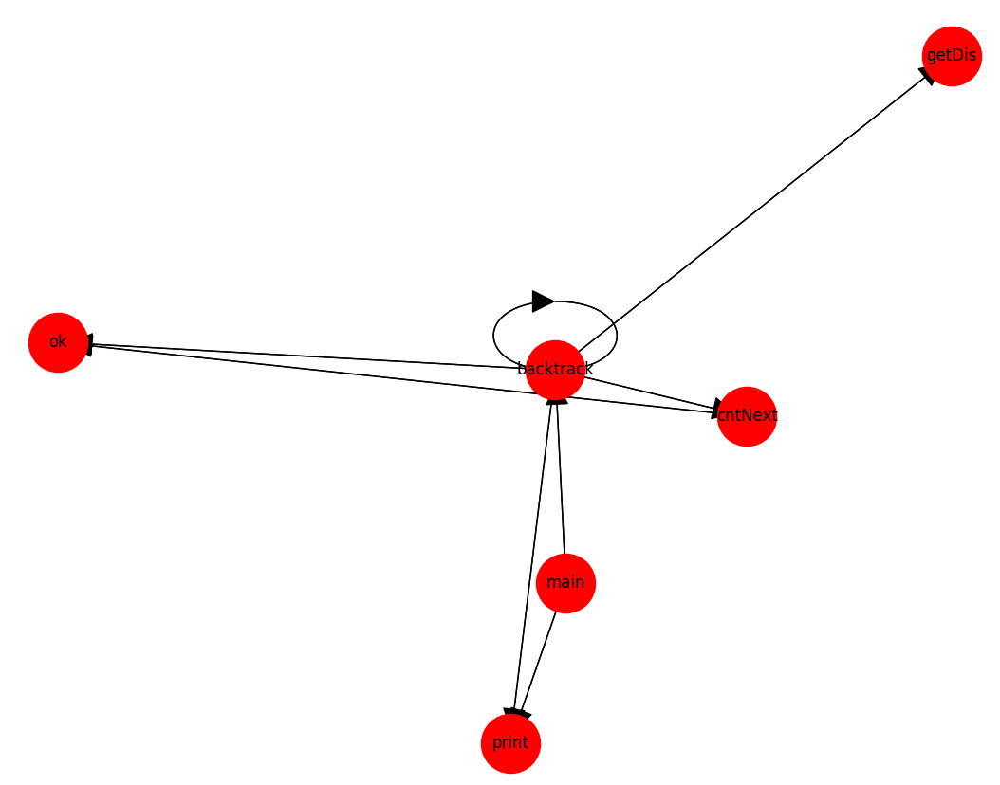

# CodeFileFuncGraph

从源文件解析其中的函数调用关系，并生成对应的函数调用关系图

> 目前只支持单个源文件

## 使用方法
### 从源文件读入
```
python fcav.py gen testfiles/test.go
```
### 从控制台输入
需要指定输入的代码类型，输入完成后 ***Ctrl+Z*** 结束输入
```
python fcav.py input cpp
```
示例：


