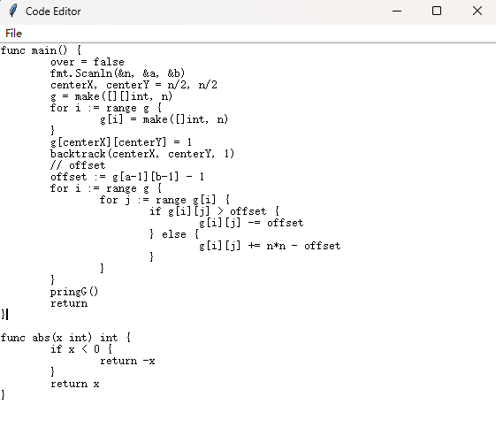

# FuncGraph

从源代码解析其中的函数调用关系，并生成对应的函数调用关系图

支持指定文件路径，或者从控制台输入

> 目前仅支持 C++ / Golang / Python
## 使用方法
### 从源文件读入
```
python fcav.py gen testfiles/test.cpp
```
示例


### 从文本框输入
需要指定输入的代码类型，输入完成后关闭窗口即可执行
```
python fcav.py editor golang
```



### 从控制台输入
需要指定输入的代码类型，输入完成后 ***Ctrl+Z*** 结束输入
```
python fcav.py input python
```
```python
def a():
    b()
    c()
    
def b():
    d()

def c():
    d()
    
def d():
    print("hello fcav")

# input Ctrl+Z for ending
# ^Z
```


