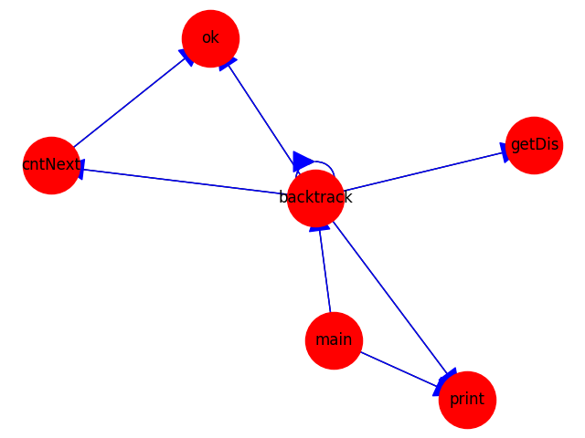
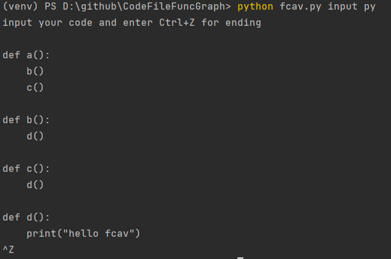
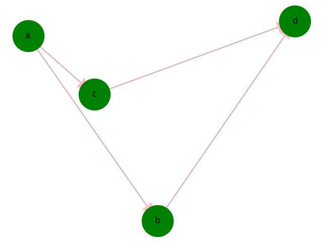

# FuncGraph

从源代码解析其中的函数调用关系，并生成对应的函数调用关系图
>支持指定文件路径，或者从控制台输入

## 使用方法
### 从源文件读入
```
python fcav.py gen testfiles/test.cpp
```
示例


### 从控制台输入
需要指定输入的代码类型，输入完成后 ***Ctrl+Z*** 结束输入
```
python fcav.py input py
```
示例



[//]: # (```python)

[//]: # (def a&#40;&#41;:)

[//]: # (    b&#40;&#41;)

[//]: # (    c&#40;&#41;)

[//]: # (    )
[//]: # (def b&#40;&#41;:)

[//]: # (    d&#40;&#41;)

[//]: # ()
[//]: # (def c&#40;&#41;:)

[//]: # (    d&#40;&#41;)

[//]: # (    )
[//]: # (def d&#40;&#41;:)

[//]: # (    print&#40;"hello fcav"&#41;)

[//]: # (# input Ctrl+Z for ending)

[//]: # (^Z)

[//]: # (```)
示例


